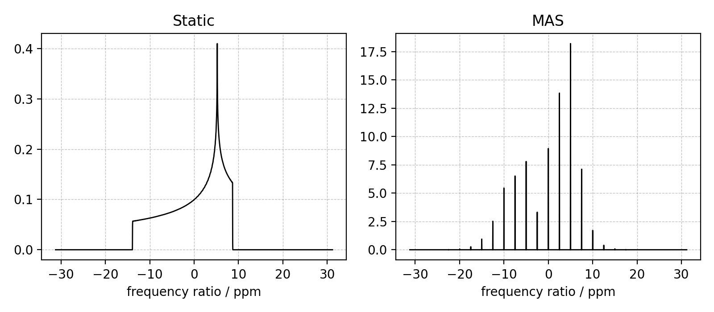

# The MRSimulator project

|              |                                                                                                                                                                                                                                                                                                                                                                            |
| ------------ | -------------------------------------------------------------------------------------------------------------------------------------------------------------------------------------------------------------------------------------------------------------------------------------------------------------------------------------------------------------------------- |
| Deployment   | [](https://pypi.python.org/pypi/mrsimulator)                                                                                                                                                |
| Build Status | [](https://github.com/deepanshs/mrsimulator/actions/workflows/continuous-integration-pip.yml) [](https://mrsimulator.readthedocs.io/en/latest/) |
| License      | [](https://opensource.org/licenses/BSD-3-Clause)                                                                                                                                                                                                                                                  |
| Metrics      | [](https://codecov.io/gh/deepanshs/mrsimulator) [](https://www.codefactor.io/repository/github/deepanshs/mrsimulator)                                                                           |

MRSimulator is an open-source Python package designed for fast and comprehensive analysis of NMR (Nuclear Magnetic Resonance) spectra in fluid and solid phases. It introduces a new approach to spectral simulation in the frequency domain based on approximations valid for most commonly used solid-state NMR methodologies, significantly improving numerical efficiency.

## Key Features

- **Open-Source and Free**: MRSimulator is fully documented, freely available, and open-source.
- **Versatile Simulations**: Capable of simulating one- and two-dimensional static, MAS (Magic Angle Spinning), and VAS (Variable Angle Spinning) spectra from a variety of NMR multiple-pulse sequences for nuclei experiencing chemical shift (nuclear shielding) and quadrupolar coupling interactions, as well as weak J and dipolar couplings.  Furthermore, it includes the ability to create customized methods for modeling spectra from more sophisticated one and two-dimensional NMR methodologies.
- **Efficiency**: Achieves high benchmarks by assuming no degeneracies in energy eigenstates and no rotational resonances during evolution periods.  It further restricts coherence transfer among transitions to pure rotations about an axis in the rotating frame or through an artificial total mixing operation between selected transitions of adjacent free evolution periods.
- **Ease of Use**: Simple-to-use, versatile, and extendable package with a stable and straightforward API.
- **Integration**: Easily incorporated into Python scripts and web apps and compatible with modern Python packages such as scikit-learn and Keras.
- **FAIR Principles**: Helps researchers follow FAIR (Findability, Accessibility, Interoperability, and Reusability) data practices.

MRSimulator is *not* intended as a general magnetic resonance simulation package for exploring complicated spin dynamics. Other software packages can handle these more demanding simulations, albeit at a more significant cost in computational time. Instead, MRSimulator focuses on the more tractable applications of solid-state NMR spectroscopy in the chemical and materials sciences. It is the ideal tool for users who want to model and fit experimental spectra to understand site populations and interaction parameters of multiple spin systems, as commonly found in disordered or heterogeneous materials.

## Packages Using MRSimulator

- [mrinversion](https://mrinversion.readthedocs.io/en/stable/)


## Install

```sh
pip install mrsimulator
```

Please refer to our [installation documentation](https://mrsimulator.readthedocs.io/en/stable/installation/users.html) for details.

#### A 1D static and MAS example

```py
from mrsimulator import Simulator, SpinSystem, Site
from mrsimulator.method.lib import BlochDecaySpectrum
import matplotlib.pyplot as plt

# Make Site and SpinSystem objects
H_site = Site(isotope="1H", shielding_symmetric={"zeta": 13.89, "eta": 0.25})
spin_system = SpinSystem(sites=[H_site])

# Make static and MAS one-pulse acquire Method objects
static = BlochDecaySpectrum(channels=["1H"]   )
mas = BlochDecaySpectrum(channels=["1H"], rotor_frequency=1000)  # in Hz

# Setup and run the Simulation object
sim = Simulator(spin_systems=[spin_system], methods=[static, mas])
sim.run()

# Plot the spectra
fig, ax = plt.subplots(1, 2, figsize=(6, 3), subplot_kw={"projection": "csdm"})
ax[0].plot(sim.methods[0].simulation.real, color="black", linewidth=1)
ax[0].set_title("Static")
ax[1].plot(sim.methods[1].simulation.real, color="black", linewidth=1)
ax[1].set_title("MAS")
plt.tight_layout()
plt.show()
```

This should produce the following figure.



<!--  -->

---

**Check out our extensive [documentation](https://mrsimulator.readthedocs.io/en/stable/index.html) and more example.**

[](https://mrsimulator.readthedocs.io/en/stable/examples/index.html)
[](https://mrsimulator.readthedocs.io/en/stable/fitting/index.html)

---

## Features

The `MRSimulator` package currently offers the following

- **Fast simulation** of one and two-dimensional solid-state NMR spectra.

- Simulation of **coupled and uncoupled spin system**

  - for spin I=1/2, and quadrupole I>1/2 nuclei
  - at arbitrary macroscopic magnetic flux density
  - at arbitrary rotor angles
  - at arbitrary spinning frequency

- A library of **NMR methods**,

  - 1D Bloch decay spectrum
  - 1D Bloch decay central transition spectrum
  - 2D Multi-Quantum Variable Angle Spinning (MQ-VAS)
  - 2D Satellite-transition Variable Angle Spinning (MQ-VAS)
  - 2D isotropic/anisotropic sideband correlation spectrum (e.g. PASS and MAT)
  - 2D Magic Angle Flipping (MAF)
  - 2D Dynamic Angle Spinning (DAS)
  - Custom user-defined methods (Method)

- **Models** for tensor parameter distribution in amorphous materials.

  - Czjzek
  - Extended Czjzek
  - Custom user-defined models

For more information, refer to the
[documentation](https://mrsimulator.readthedocs.io/en/stable/).

## Reporting Bugs

Submit bug reports or feature requests on the [Github issue tracker](https://github.com/deepanshs/mrsimulator/issues).

Discussions are welcome on the [Github discussion](https://github.com/deepanshs/mrsimulator/discussions) page.

## How to cite

If you use MRSimulator in your publication, please consider citing the following work implemented in MRSimulator.

- Please use the GitHub citation tool to cite this repository. The tool in located in the About section under the `Cite this repository` category.

- Srivastava D.J. and Grandinetti P.J. (2024) Simulating multipulse NMR spectra of polycrystalline solids in the frequency domain. *J. Chem. Phys*. 160, 234110, https://doi.org/10.1063/5.0209887

- Srivastava D.J., Baltisberger J.H and Grandinetti P.J. (2024) Rapid simulation of two-dimensional spectra with correlated anisotropic dimension. *J. Chem. Phys*. 160, 134104, https://doi.org/10.1063/5.0200042

- Srivastava D.J., Vosegaard T, Massiot D, Grandinetti P.J. (2020) Core Scientific Dataset Model: A lightweight and portable model and file format for multi-dimensional scientific dataset. *PLOS ONE* 15(1): e0225953. https://doi.org/10.1371/journal.pone.0225953

_Additionally, if you use lmfit for least-squares fitting, consider citing the lmfit package._ Zenodo. https://doi.org/10.5281/zenodo.4516651
