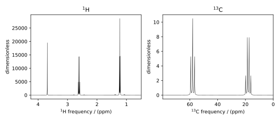

Isotopomers of Ethanol
^^^^^^^^^^^^^^^^^^^^^^

In this introductory we will simulate ¹H and ¹³C isotopomers of ethanol. The resulting spectrum
will include the characteristic
:math:`^{13}\text{C}` `satellite peaks <https://en.wikipedia.org/wiki/Carbon-13_NMR_satellite>`_.
The code was taken from the
`ethanol example <sphx_glr_examples_1D_simulation(crystalline)_plot_8_Ethanol.py>`_
in our simulation gallery. For more in-depth discussion ((something...)).

Importing Packages and Classes
------------------------------

It is good practice to import packages and classes and classes at the beginning of your code.
Here we import everything we will use in this example

.. code-block:: python

    import matplotlib.pyplot as plt

    from mrsimulator import Simulator, Site, SpinSystem, Coupling
    from mrsimulator.methods import BlochDecaySpectrum
    from mrsimulator import signal_processing as sp

Creating the Spin Systems
-------------------------

First create the :math:`^1\text{H}` and :math:`^{13}\text{C}` sites for ethanol.

.. code-block:: python

    # Shifts in ppm
    H_CH3 = Site(isotope="1H", isotropic_chemical_shift=1.226)
    H_CH2 = Site(isotope="1H", isotropic_chemical_shift=2.61)
    H_OH = Site(isotope="1H", isotropic_chemical_shift=3.687)

    C_CH3 = Site(isotope="13C", isotropic_chemical_shift=18)
    C_CH2 = Site(isotope="13C", isotropic_chemical_shift=58)

Now we will use these sites along with coupling objects to create our isotopomers.

Isotopomer 1
''''''''''''

The satellite peaks come from couplings between :math:`^{1}\text{H}` and
:math:`^{13}\text{C}` in low-abundance isotopomers.

Now, let's define the couplings and build the spin system for the most abundant
isotopomer pictured below. Each number next to an atom corresponds to that atom's
index in the sites list.

.. figure::  ../_static/iso1.*
    :width: 200
    :alt: figure
    :align: center

    An isotopomer of ethanol containing all :math:`^{1}\text{H}` and all
    :math:`^{12}\text{C}` isotopes.

.. code-block:: python

    iso1_sites = [H_CH3, H_CH3, H_CH3, H_CH2, H_CH2, H_OH]

    # All isotropic_j shifts in ppm
    HH_coupling_1 = Coupling(site_index=[0, 3], isotropic_j=7)
    HH_coupling_2 = Coupling(site_index=[0, 4], isotropic_j=7)
    HH_coupling_3 = Coupling(site_index=[1, 3], isotropic_j=7)
    HH_coupling_4 = Coupling(site_index=[1, 4], isotropic_j=7)
    HH_coupling_5 = Coupling(site_index=[2, 3], isotropic_j=7)
    HH_coupling_6 = Coupling(site_index=[2, 4], isotropic_j=7)

    iso1_couplings = [
        HH_coupling_1,
        HH_coupling_2,
        HH_coupling_3,
        HH_coupling_4,
        HH_coupling_5,
        HH_coupling_6,
    ]

    isotopomer1 = SpinSystem(sites=iso1_sites, couplings=iso1_couplings, abundance=97.812)

.. note::
    The abundance values were calculated with an assumption that only
    :math:`^1\text{H}` and :math:`^{16}\text{O}` are present.  The abundance
    of :math:`^{12}\text{C}` is 98.9%, and the abundance of :math:`^{13}\text{C}`
    is 1.1%. So, the probability of the most abundant isotopomer is
    :math:`0.989 \times 0.989=0.97812`

Isotopomer 2
''''''''''''

Replacing the methyl carbon with a :math:`^{13}\text{C}` isotope we get the following
isotopomer pictured below (:math:`^{13}\text{C}` marked in blue)

.. figure::  ../_static/iso2.*
    :width: 200
    :alt: figure
    :align: center

    Second isotopomer of ethanol containing all :math:`^{1}\text{H}`,
    :math:`^{13}\text{C}` methyl, and :math:`^{12}\text{C}` methylene isotopes.

We now construct the spin system for this isotopomer.

.. code-block:: python

    iso2_sites = [H_CH3, H_CH3, H_CH3, H_CH2, H_CH2, H_OH, C_CH3]

    # Define methyl 13C - 1H couplings
    CH3_coupling_1 = Coupling(site_index=[0, 6], isotropic_j=125)
    CH3_coupling_2 = Coupling(site_index=[1, 6], isotropic_j=125)
    CH3_coupling_3 = Coupling(site_index=[2, 6], isotropic_j=125)

    # Add new couplings to existing 1H - 1H couplings
    iso2_couplings = iso1_couplings + [CH3_coupling_1, CH3_coupling_2, CH3_coupling_3]

    isotopomer2 = SpinSystem(sites=iso2_sites, couplings=iso2_couplings, abundance=1.088)

Isotopomer 3
''''''''''''

Lastly, we build the sites, couplings, and spin system for the other
isotopomer with the methylene carbon replaced with :math:`^{13}\text{C}` pictured
below (:math:`^{13}\text{C}` marked in blue)

.. figure::  ../_static/iso3.*
    :width: 200
    :alt: figure
    :align: center

    Third isotopomer of ethanol containing all :math:`^{1}\text{H}`,
    :math:`^{12}\text{C}` methyl, and :math:`^{13}\text{C}` methylene isotopes.

.. code-block:: python

    iso3_sites = [H_CH3, H_CH3, H_CH3, H_CH2, H_CH2, H_OH, C_CH2]

    # Define methylene 13C - 1H couplings
    CH2_coupling_1 = Coupling(site_index=[3, 6], isotropic_j=141)
    CH2_coupling_2 = Coupling(site_index=[4, 6], isotropic_j=141)

    # Add new couplings to existing 1H - 1H couplings
    iso3_couplings = iso1_couplings + [CH2_coupling_1, CH2_coupling_2]

    isotopomer3 = SpinSystem(sites=iso3_sites, couplings=iso3_couplings, abundance=1.088)

Methods
-------

Now, we define simple 1 pulse-acquire methods for both :math:`^1\text{H}` and
:math:`^{13}\text{C}`.

.. code-block:: python

    method_H = BlochDecaySpectrum(
        channels=["1H"],
        magnetic_flux_density=9.4,  # in T
        spectral_dimensions=[
            dict(
                count=16000,
                spectral_width=1.5e3,  # in Hz
                reference_offset=950,  # in Hz
                label="$^{1}$H frequency",
            )
        ],
    )

    method_C = BlochDecaySpectrum(
        channels=["13C"],
        magnetic_flux_density=9.4,  # in T
        spectral_dimensions=[
            dict(
                count=32000,
                spectral_width=8e3,  # in Hz
                reference_offset=4e3,  # in Hz
                label="$^{13}$C frequency",
            )
        ],
    )

Simulation
----------

Now, we create an instance of the simulator object, add our three spin
systems, add our two methods, and run the simulation.

.. code-block:: python

    spin_systems = [isotopomer1, isotopomer2, isotopomer3]
    methods = [method_H, method_C]
    sim = Simulator(spin_systems=spin_systems, methods=methods)
    sim.run()

Signal Processing
-----------------

Let's set up our post-simulation processing. We apply 1 Hz and 20 Hz of exponential line
broadening to the proton and carbon methods respectively

.. GENERATED FROM PYTHON SOURCE LINES 177-193

.. code-block:: python
    # Get the simulation data
    H_data = sim.methods[0].simulation
    C_data = sim.methods[1].simulation

    # Create the signal processors
    processor_1H = sp.SignalProcessor(
        operations=[
            sp.IFFT(),
            sp.apodization.Exponential(FWHM="1 Hz"),
            sp.FFT(),
        ]
    )

    processor_13C = sp.SignalProcessor(
        operations=[
            sp.IFFT(),
            sp.apodization.Exponential(FWHM="20 Hz"),
            sp.FFT(),
        ]
    )

    # apply the signal processors
    processed_H_data = processor_1H.apply_operations(data=H_data)
    processed_C_data = processor_13C.apply_operations(data=C_data)

Plotting the Data
-----------------

Now that we have our processed data, we can plot the two spectra.

.. code-block:: python

    fig, ax = plt.subplots(
        nrows=1, ncols=2, subplot_kw={"projection": "csdm"}, figsize=[8, 3.5]
    )

    ax[0].plot(processed_H_data.real, color="black", linewidth=0.5)
    ax[0].invert_xaxis()
    ax[0].set_title("$^1$H")

    ax[1].plot(processed_C_data.real, color="black", linewidth=0.5)
    ax[1].invert_xaxis()
    ax[1].set_title("$^{13}$C")

    plt.tight_layout()
    plt.show()

Note the :math:`^{13}\text{C}` satellites seen on either side of the peaks near
1.2 ppm and 2.6 ppm in the :math:`^1\text{H}` spectrum.
