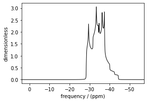
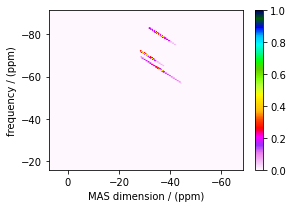
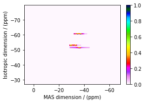
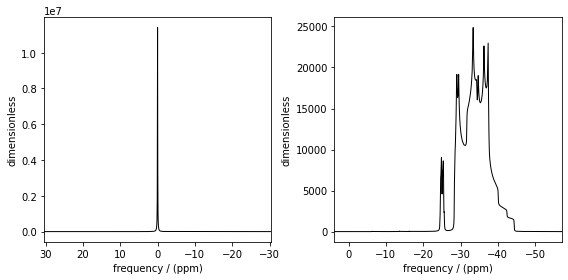

.. _more_method_documentation:

===================
Methods For the User
===================

The Method object is where the versatility of mrsimulator becomes clear.
Most NMR density matrix simulations do all the calculations in the
time-domain, but mrsimulator performs its calculations in the frequency
domain. In these time-domain programs, you may set up an experiment that
walks through all aspects of a pulse sequence, but in mrsimulator, you
only need to set up a method describing all the spectral dimensions you
are simulating.

Each Method object holds global parameters, like magnetic_flux_density,
and a list of SpectralDimension objects, each one describing a dimension
of a multi-dimensional spectrum. Each SpectralDimension object contains
a list of events, in which you can adjust parameters, like rotor speed
or angle, select transitions based on their :math:`p` or :math:`d`
symmetries, etc. To illustrate this, let’s look at a few different
common NMR experiments on :math:`RbNO_3`, starting with a simple 1D
pulse-acquire experiment. We begin by making all necessary imports.

.. code:: ipython3

    from mrsimulator import Site, SpinSystem, Simulator
    from mrsimulator.method import Method
    from mrsimulator.method.spectral_dimension import SpectralDimension
    from mrsimulator.method.event import SpectralEvent, MixingEvent
    from mrsimulator import signal_processing as sp
    
    import matplotlib.pyplot as plt

Next, we build the spin system for :math:`RbNO_3`.

.. code:: ipython3

    site1 = Site(
        isotope="87Rb",
        isotropic_chemical_shift = -27.4, #ppm,
        quadrupolar = {"Cq":1.68e6, "eta": 0.2}, #Cq in Hz
    )
    
    site2 = Site(
        isotope="87Rb",
        isotropic_chemical_shift = -28.5, #ppm,
        quadrupolar = {"Cq":1.94e6, "eta": 1}, #Cq in Hz
    )
    site3 = Site(
        isotope="87Rb",
        isotropic_chemical_shift = -31.3, #ppm,
        quadrupolar = {"Cq":1.72e6, "eta": 0.5}, #Cq in Hz
    )
    
    sites = [site1, site2, site3]
    spin_systems = [SpinSystem(sites=[s]) for s in sites]

Now, we build the method. We will be building it from the generic Method
object, but you could just as easily use the built-in BlochDecaySpectrum
method.

.. code:: ipython3

    pulseacquire = Method(
        channels=["87Rb"],
        magnetic_flux_density = 9.4, #in T
        rotor_frequency= 10000, # in Hz
        spectral_dimensions=[
            SpectralDimension(
                count = 1e6,
                spectral_width = 3e6,
                reference_offset = -3.5e3,
                events=[
                    SpectralEvent(transition_query = [{"ch1":{"P":[-1]}}])
                ]
            )
            
        ]
    )

The *channels* key holds the nucleus being probed. The
*magnetic_flux_density* key holds the magnetic field stength in T, and
*rotor_frequency* holds the rotor frequency in Hz. The
*spectral_dimensions* key holds a list of SpectralDimension objects,
each containing a *count* key, containing the number of points in that
dimension, a *spectral_width* key, containing the spectral width in Hz,
and *reference_offset* containing, the reference offset of this
dimension in Hz. It also contains an *events* key, which contains a list
of different events. In this example, we are using a spectral event to
select the :math:`p=m_f-m_i=-1` coherences for this simulation (see the
advanced users page for a more in-depth description of different types
of events).

We then set up the simulator object and run the simulation.

.. code:: ipython3

    sim = Simulator()
    sim.spin_systems = spin_systems
    sim.methods = [pulseacquire]
    sim.config.number_of_sidebands = 256
    sim.run()

Now, we create a signal processing object to add a bit of exponential
apodization. Then we apply the apodization and plot the processed data.

.. code:: ipython3

    processor= sp.SignalProcessor(operations=[
        sp.IFFT(),
        sp.apodization.Exponential(FWHM="10 Hz"),
        sp.FFT(),
    ])
    
    processed_data = processor.apply_operations(data=sim.methods[0].simulation.real)
    
    fig, ax = plt.subplots(
        nrows=1,
        ncols=2,
        subplot_kw={"projection": "csdm"},
        figsize=[8, 4]    
    )
    
    ax[0].plot(processed_data.real, color="black", linewidth=1)
    ax[0].invert_xaxis()
    ax[1].plot(processed_data.real, color="black", linewidth=1)
    ax[1].set_xlim(-50,0)
    ax[1].invert_xaxis()
    plt.tight_layout()
    plt.show()

.. image:: ../../_static/method_blochdecay.png

Now, let’s say we wanted to supress the satellites. To do this, we need
to simulate a central-transition-selective 1D experiment. To do this, we
also specify a :math:`D` transition query, given as
:math:`D = m_f^2 -m_i^2`. For the central-transition, we specify
:math:`D=0`. We will build this method using the generic method object
(the same method is provided as BlochDecayCTSpectrum for convenience).

.. code:: ipython3

    ct_pulseacquire = Method(
        channels=["87Rb"],
        magnetic_flux_density = 9.4, #in T
        rotor_frequency= 10000, # in Hz
        spectral_dimensions=[
            SpectralDimension(
                count = 20000,
                spectral_width = 8e3,
                reference_offset = -3.5e3,
                events=[
                    SpectralEvent(transition_query = [{"ch1":{"P":[-1], "D":[0]}}])
                ]
            )
        ]
    )

We simply add this new method to the simulator object, run the
simulation, apply our proceessing, and plot the data.

.. code:: ipython3

    sim.methods = [pulseacquire, ct_pulseacquire]
    sim.run()
    
    processed_data = processor.apply_operations(data=sim.methods[1].simulation.real)
    
    plt.figure(figsize=(4.25, 3.0))
    ax = plt.subplot(projection="csdm")
    # ax.plot(sim.methods[0].simulation, color="blue", linewidth=1)
    ax.plot(processed_data.real, color="black", linewidth=1)
    ax.invert_xaxis()
    plt.tight_layout()
    plt.show()

Now, let’s simulate an 3Q-MAS spectrum, again using the generic Method
object (a convenience method is provided in ThreeQ_VAS)

.. code:: ipython3

    mqmas = Method(
        channels=["87Rb"],
        magnetic_flux_density = 9.4, #in T
        rotor_frequency= 10000, # in Hz
        spectral_dimensions=[
            SpectralDimension(
                count = 128,
                spectral_width = 10e3,
                reference_offset = -7e3,
                events=[
                    SpectralEvent(transition_query = [{"ch1":{"P":[-3], "D":[0]}}])
                ]
            ),
            SpectralDimension(
                count=256,
                spectral_width=1e4, #in Hz
                reference_offset= -4e3, #in Hz
                label="MAS dimension",
                events=[
                    SpectralEvent(transition_query = [{"ch1":{"P":[-1], "D":[0]}}])
                ]
            )
        ],
    )

Now, instead of just one item in the list of spectral dimensions, we
have two, because 3Q-MAS is a two-dimensional experiment. In the first
dimension, we are selecting the triple-quantum coherence by specifying a
transition query of :math:`p=-3` and :math:`d=0`. In the MAS dimension,
we are selecting the central transition with a transition query of
:math:`p=-1` and :math:`d=0`.

Again, we add this method to the simulation, run the simulation, and
plot the data.

.. code:: ipython3

    sim.methods = [mqmas]
    sim.run()
    
    data = sim.methods[0].simulation
    
    plt.figure(figsize=(4.25, 3.0))
    ax = plt.subplot(projection="csdm")
    cb = ax.imshow(data.real / data.real.max(), aspect="auto", cmap="gist_ncar_r")
    plt.colorbar(cb)
    ax.invert_xaxis()
    ax.invert_yaxis()
    plt.tight_layout()
    plt.show()

For 3Q-MAS experiments, however, the spectrum is often sheared and
scaled to make the vertical dimension the purely isotropic dimension.
This can be accomplished with an affine matrix added to the method.
Let’s re-make our 3Q-MAS method with this affine matrix.

.. code:: ipython3

    sheared_mqmas = Method(
        channels=["87Rb"],
        magnetic_flux_density = 9.4, #in T
        rotor_frequency= 10000, # in Hz
        spectral_dimensions=[
            SpectralDimension(
                count = 128,
                spectral_width = 7e3,
                reference_offset = -7e3,
                label="Isotropic dimension",
                events=[
                    SpectralEvent(transition_query = [{"ch1":{"P":[-3], "D":[0]}}])
                ]
            ),
            SpectralDimension(
                count=256,
                spectral_width=1e4, #in Hz
                reference_offset= -4e3, #in Hz
                label="MAS dimension",
                events=[
                    SpectralEvent(transition_query = [{"ch1":{"P":[-1], "D":[0]}}])
                ]
            )
        ],
        affine_matrix= [[9/16, 7/16], [0, 1]] #[9/16, 7/16, 0, 1] #
    )

Again, we now add the method to the simulator object, run the
simulation, and plot the data.

.. code:: ipython3

    sim.methods = [sheared_mqmas]
    sim.run()
    
    data = sim.methods[0].simulation
    
    plt.figure(figsize=(4.25, 3.0))
    ax = plt.subplot(projection="csdm")
    cb = ax.imshow(data.real / data.real.max(), aspect="auto", cmap="gist_ncar_r")
    plt.colorbar(cb)
    ax.invert_xaxis()
    ax.invert_yaxis()
    plt.tight_layout()
    plt.show()

For the convenience methods mentioned here and more, please see our
methods library. For a more in-depth description of creating methods,
see our advanced users methods page.

.. code:: ipython3

    hahn = Method(
        channels=["87Rb"],
        magnetic_flux_density = 9.4, #in T
        rotor_frequency= 10000, # in Hz
        spectral_dimensions=[
            SpectralDimension(
                count=2048,
                spectral_width = 8e3,
    #             reference_offset = -3.5e3,
                events=[
                    SpectralEvent(fraction=0.5, transition_query=[{"ch1": {"P": [1]}}]),
                    MixingEvent(mixing_query={"ch1": {"tip_angle": 3.14159, "phase": 0}}),
                    SpectralEvent(fraction=0.5, transition_query=[{"ch1": {"P": [-1]}}]),
                ]
            )
        ]
    )
    
    solid = Method(
        channels=["87Rb"],
        magnetic_flux_density = 9.4, #in T
        rotor_frequency= 10000, # in Hz
        spectral_dimensions=[
            SpectralDimension(
                count=2048,
                spectral_width = 8e3,
                reference_offset = -3.5e3,
                events=[
                    SpectralEvent(fraction=0.5, transition_query=[{"ch1": {"P": [-1]}}]),
                    MixingEvent(mixing_query={"ch1": {"tip_angle": 3.14159 / 2, "phase": 0}}),
                    SpectralEvent(fraction=0.5, transition_query=[{"ch1": {"P": [-1]}}]),
                ]
            )
        ]
    )
    
    sim = Simulator()
    sim.spin_systems = spin_systems
    sim.methods = [hahn, solid]
    sim.config.number_of_sidebands = 256
    sim.run()

.. code:: ipython3

    fig, ax = plt.subplots(
        nrows=1,
        ncols=2,
        subplot_kw={"projection": "csdm"},
        figsize=[8, 4]    
    )
    
    hahndata = sim.methods[0].simulation
    soliddata = sim.methods[1].simulation
    
    processed_hahndata = processor.apply_operations(data=hahndata)
    processed_soliddata = processor.apply_operations(data=soliddata)
    
    ax[0].plot(processed_hahndata.real, color="black", linewidth=1)
    ax[0].invert_xaxis()
    ax[1].plot(processed_soliddata.real, color="black", linewidth=1)
    # ax[1].set_xlim(-50,0)
    ax[1].invert_xaxis()
    plt.tight_layout()
    plt.show()

