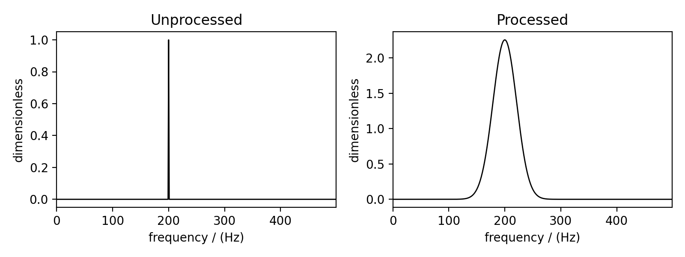
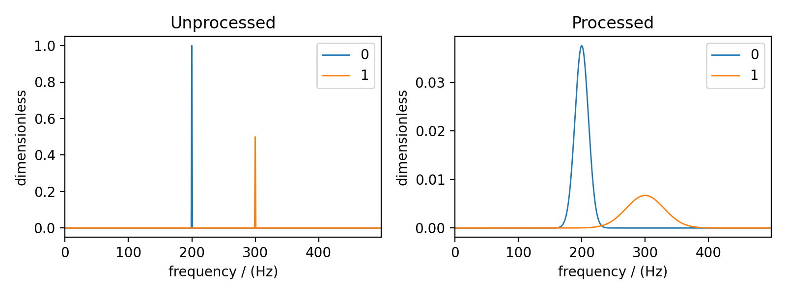

.. _signal_processing_documentation:

=================
Signal Processing
=================

.. note::

    The signal processing module can operate on experimental datasets, but it is intended for
    processing simulated spectra. We recommend pre-processing experimental datasets with other
    applications before importing them into ``mrsimulator``.

After running a simulation, you may need to apply some post-simulation signal processing.
For example, you may need to scale the simulated spectrum to match experimental intensities,
or you may want to convolve the spectrum with a Lorentzian, Gaussian, or other line-broadening
function. For this reason, ``mrsimulator`` offers some frequently used NMR signal
processing tools within the ``mrsimulator.signal_processing`` module.

.. seealso::

    :ref:`signal_processing_examples` for notebooks using common processing functions.

CSDM object
-----------

The simulated spectrum is held in a CSDM [#f1]_ object which supports any multi-dimensional
scientific datasets (NMR, EPR, FTIR, GC, etc.). For more information, see the
`csdmpy documentation <https://csdmpy.readthedocs.io/en/stable/>`__.

``SignalProcessor`` class
-------------------------

Signal processing is a series of operations which are sequentially applied to the dataset.
In ``mrsimulator``, the :py:class:`~mrsimulator.signal_processing.SignalProcessor` object is
used to apply operations. Here we create a new signal processing object

.. code-block:: python
    # Import the signal_processing module
    from mrsimulator import signal_processing as sp

    # Create a new SignalProcessor object
    processor = sp.SignalProcessor()

Each signal processor object holds a list of operations under the *operations* attribute. Below
we add operations to apply Gaussian line broadening as well as a scale factor.

.. code-block:: python

    processor.operations = [
        sp.IFFT(),
        sp.apodization.Gaussian(FWHM="50 Hz"),
        sp.FFT(),
        sp.Scale(factor=120),
    ]

First, an inverse Fourier transform is applied to the dataset. Then, a gaussian apodization with
a full width at half maximum of 30 Hz in the frequency domain is applied. The unit used for the
*FWHM* attribute corresponds to the dimensionality of the dataset. By choosing Hz, we imply the
dataset is in units of frequency.
Finally, a forward Fourier transform is applied to the apodized dataset and all points are scaled
up by 120 times.

.. note::

    Convolutions in ``mrsimulator`` are preformed using the
    `Convolution Theorem <https://en.wikipedia.org/wiki/Convolution_theorem>`_. A spectrum is
    Fourier transformed and apodizations are preformed in the time domain before being transformed
    back into the frequency domain.

Let's create a CSDM object and then apply the operations to visualize the results.

.. code-block:: python

    import csdmpy as cp
    import numpy as np

    # Create a CSDM object with delta function at 200 Hz
    test_data = np.zeros(500)
    test_data[200] = 1
    csdm_object = cp.CSDM(
        dependent_variables=[cp.as_dependent_variable(test_data)],
        dimensions=[cp.LinearDimension(count=500, increment="1 Hz")],
    )

To apply the previously defined signal processing operations to the above CSDM object, use
the :py:meth:`~mrsimulator.signal_processing.SignalProcessor.apply_operations` method of the
``SignalProcessor`` instance as follows

.. code-block:: python

    processed_data = processor.apply_operations(data=csdm_object)

The variable ``processed_data`` is another CSDM object holding the dataset after the list of
operations has been applied to ``csdm_object``. Below is a plot comparing the unprocessed and
processed data

..
.. .. code-block:: python
..
..     import matplotlib.pyplot as plt
..     _, ax = plt.subplots(1, 2, figsize=(8, 3), subplot_kw={"projection":"csdm"})
..     ax[0].plot(csdm_object, color="black", linewidth=1)
..     ax[0].set_title("Unprocessed")
..     ax[1].plot(processed_data.real, color="black", linewidth=1)
..     ax[1].set_title("Processed")
..     plt.tight_layout()
..     plt.show()
..

    The unprocessed data (left) and processed data with a Gaussian convolution and scale factor
    (right).

Applying Operations along a Dimension
-------------------------------------

Multi-dimensional NMR simulations may need different operations applied along different
dimensions. Each operation has the attribute *dim_index* which is used to apply operations
along a certain dimension.

By default, *dim_index* is ``None`` and is applied along the 1st dimension. An integer or list
of integers can be passed to *dim_index* specifying the dimensions. Below are examples of
specifying the dimensions

.. code-block:: python

    # Gaussian apodization along the first dimension (default)
    sp.apodization.Gaussian(FWHM="10 Hz")

    # Constant offset along the second dimension
    sp.baseline.ConstantOffset(offset=10, dim_index=1)

    # Lorentzian (exponential) along the first and third dimensions
    sp.apodization.Exponential(FWHM="10 Hz", dim_index=[0, 2])

Applying Apodizations to specific Dependent Variables
-----------------------------------------------------

Each dimension in a simulated spectrum can hold multiple dependent variables (a.k.a.
contributions from multiple spin systems). Each spin system may need different convolutions
applied to match an experimental spectrum. The
:py:class:`~mrsimulator.signal_processing.Apodization` sub-classes have the *dv_index*
attribute which specifies which dependent variable (spin system) to apply the operation on.
By default, *dv_index* is ``None`` and will apply the convolution to all dependent variables
in a dimension.

.. note::
    The index of a
    dependent variable (spin system) corresponds to the order of spin systems in the
    :py:attr:`~mrsimulator.Simulator.spin_systems` list.

.. code-block:: python

    processor = sp.SignalProcessor(
        operations=[
            sp.IFFT(),
            sp.apodization.Gaussian(FWHM="25 Hz", dv_index=0),
            sp.apodization.Gaussian(FWHM="70 Hz", dv_index=1),
            sp.IFFT(),
        ]
    )

The above list of operations will apply a step apodization as well as 25 and 70 Hz of Gaussian
line broadening to dependent variables at index 0 and 1, respectively

Let's add another depended variable to the previously created CSDM object to see targeting
specific dependent variables.

.. code-block:: python

    test_data = np.zeros(500)
    test_data[300] = 1
    csdm_object.add_dependent_variable(cp.as_dependent_variable(test_data))

Now, we again apply the operations with the
:py:meth:`~mrsimulator.signal_processing.SignalProcessor.apply_operations` method.
The comparison of the unprocessed and processed data is also show below.

.. code-block::

    processed_data = processor.apply_operations(data=csdm_object)

Below is a plot of the dataset before and after applying the operations

    The unprocessed data (left) and the processed data with convolutions applied to different
    dependent variables.

.. [#f1] Srivastava, D. J., Vosegaard, T., Massiot, D., Grandinetti, P. J.,
            Core Scientific Dataset Model: A lightweight and portable model and
            file format for multi-dimensional scientific data, PLOS ONE,
            **15**, 1-38, (2020).
            `DOI:10.1371/journal.pone.0225953 <https://doi.org/10.1371/journal.pone.0225953>`_
