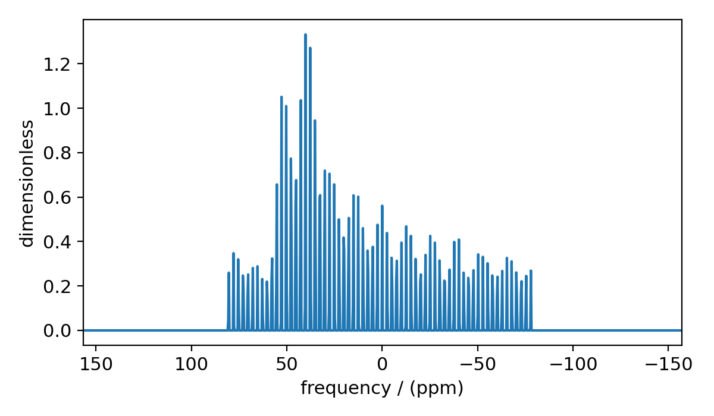
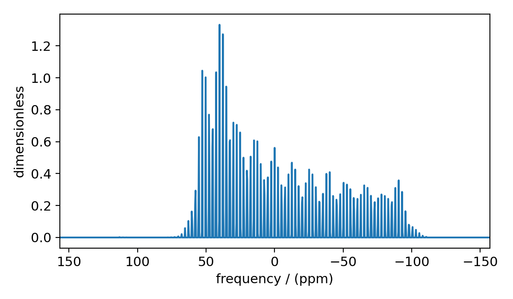
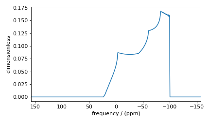
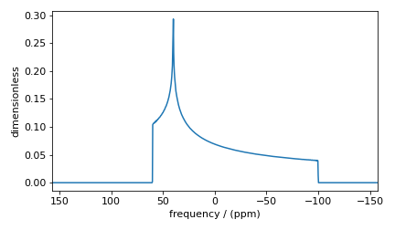
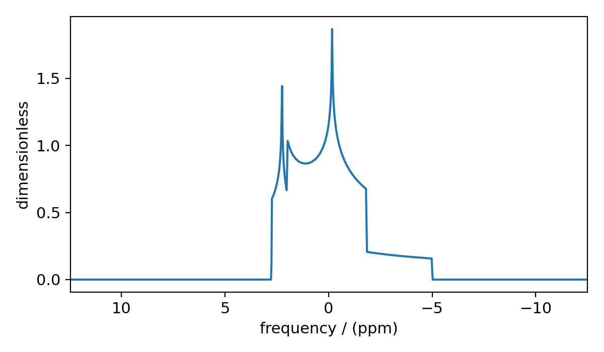
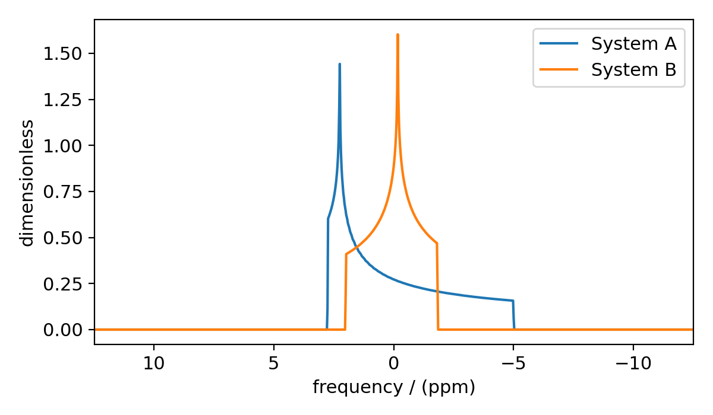

.. _simulator_documentation:

=========
Simulator
=========

The :ref:`simulator_api` object is the core of the ``mrsimulator`` library. Each **Simulator**
object holds a list of :ref:`spin_sys_api` objects and a list of :ref:`method_api` objects.
A simulator object also holds a :ref:`config_api` object which can be modified to change aspects
of the simulation as discussed below.

Set Up
------

Setting up a simulator object and running a simulation is simple. Below we add some arbitrary
spin systems and methods to a simulator object.

.. code-block:: python

    from mrsimulator import Site, Simulator, spin_system
    from mrsimulator.methods import BlochDecaySpectrum

    # Setup the spin system and method objects
    system1 = SpinSystem(sites=[Site(isotope="1H")])  # Proton spin system
    system2 = SpinSystem(sites=[Site(isotope="17O")])  # Oxygen spin system
    system3 = SpinSystem(sites=[Site(isotope="29Si")])  # Silicon spin system
    method1 = BlochDecaySpectrum(channels=["1H"])
    method2 = BlochDecaySpectrum(channels=["29Si"])

    # Create the Simulator object
    sim = Simulator()
    sim.spin_systems = [system1, system2, system3]  # Add list of spin systems
    sim.methods = [method1, method2]  # add list of methods

``sim`` is a **Simulator** object which holds three spin systems and two methods. See
:ref:`spin_system_documentation` and :ref:`method_documentation` documentation for more
information on the respective classes.

Running a Simulation
--------------------

To simulate the NMR spectrum of the given spin systems using each method, call the simulator
class method :meth:`~mrsimulator.Simulator.run`.

.. code-block:: python

    sim.run()

The simulated spectrum is stored as a CSDM object in each method object under the
``simulation`` attribute. For more information on the Core Scientific Data Model (CSDM),
see the `csdmpy documentation <https://csdmpy.readthedocs.io/en/stable/>`_.
Below we put the simulated spectra of the method at index 0 into the variable ``data_0``

.. code-block:: python

    data_0 = sim.methods[0].simulation
    # data_n = sim.methods[n].simulation (for multiple methods)

.. THESE WILL GO UNDER SIMULATOR API
.. Specifying which methods to simulate
.. ''''''''''''''''''''''''''''''''''''
..
.. By default, :meth:`~mrsimulator.Simulator.run` simulates the spectrum of the given spin systems
.. over all methods. You may specify which methods to simulate using the ``method_index`` argument.
.. ``method_index`` accepts a list of integers specifying the index of methods to simulate. The code
.. below simulates the first and third methods in ``sim``
..
.. .. code-block:: python
..
..     sim.run(method_index=[0, 2])
..
.. Packing the data as Numpy array
.. '''''''''''''''''''''''''''''''
..
.. By default the simulated spectrum is packed into a CSDM object. The spectrum can also be packed
.. as a numpy array by using the ``pack_as_csdm`` argument.
..
.. .. code-block:: python
..
..     sim.run(pack_as_csdm=False)
..
.. Although this packing the simulated spectrum as a numpy array is possible,
.. **we strongly recommend against it since this breaks serialization**.

.. _config_simulator:

Configuring the Simulator Object
--------------------------------

Up until now, we have been using the simulator object with the default setting.
In ``mrsimulator``, we choose the default settings such that it applies to a wide
range of simulations including, static, magic angle spinning (MAS), and
variable angle spinning (VAS) spectra. In certain situations, however, the
default settings are not sufficient to accurately represent the spectrum.

The following code is used to create the plots in this section

.. code-block:: python

    import matplotlib.pyplot as plt
    import matplotlib as mpl

    mpl.rcParams["figure.figsize"] = (6, 3.5)
    mpl.rcParams["font.size"] = 11

    # function to render figures.
    def plot(csdm_object):
        ax = plt.subplot(projection="csdm")
        ax.plot(csdm_object, linewidth=1.5)
        ax.invert_xaxis()
        plt.tight_layout()
        plt.show()

----

Number of Sidebands
'''''''''''''''''''

The number of sidebands simulated is determined by the attribute ``sim.config.number_of_sidebands``
where ``sim`` is a simulator object. The default value is 64 and is sufficient for most cases.

In certain circumstances,
especially when the anisotropy is large or the rotor spin frequency is low, 64 sidebands might
not be sufficient.

.. code-block:: python

    from mrsimulator import Simulator, SpinSystem, Site
    from mrsimulator.methods import BlochDecaySpectrum
    from mrsimulator.spin_system.tensors import SymmetricTensor

    # create a site with a large anisotropy of 100 ppm
    Si29_site = Site(isotope="29Si", shielding_symmetric=SymmetricTensor(zeta=100, eta=0.2))
    Si29_sys = SpinSystem(sites=[Si29_site])

    # create a method with a low rotor frequency of 200 Hz
    method = BlochDecaySpectrum(
        channels=["29Si"],
        rotor_frequency=200,
        spectral_dimensions=[dict(count=1024, spectral_width=25000)],
    )

    sim = Simulator(spin_systems=[Si29_sys], methods=[method])
    sim.run()

    # plot the dataset using the method defined above
    plot(sim.methods[0].simulation)

    Inaccurate simulation resulting from computing low number of sidebands.

Looking at the spinning sideband patterns, we see an abrupt termination of the sideband
amplitudes at the edges. This inaccurate simulation arises from evaluating a small number of
sidebands relative to the given anisotropy. Increasing the number of sidebands to 90 should
resolve the issue.

.. code-block:: python

    # sim already holds our spin systems and methods; no need to reconstruct
    # set number of sidebands to 90
    sim.config.number_of_sidebands = 90
    sim.run()
    plot(sim.methods[0].simulation)

    Accurate simulation after increasing number of sidebands computed.

Conversely, 64 sidebands might be redundant, in which case the number of sidebands can be reduced.
Reducing the number of sidebands
will significantly improve performance, which might save computation time
when used in iterative algorithms, such as least-squares minimization.

Integration Volume
''''''''''''''''''

The attribute ``sim.config.integration_volume`` is an enumeration with two string literals,
``octant`` and ``hemisphere``. The integration volume refers to the volume of the sphere over
which the NMR frequencies are integrated. The default value is *octant*, i.e., the spectrum
comprises of integrated frequencies arising from the positive octant of the sphere.
``mrsimulator`` can exploit the orientational symmetry of
the problem, and thus optimize the simulation by performing a partial integration.

To learn more about the orientational symmetries, refer to Eden et. al. [#f4]_

Consider the :math:`^{29}\text{Si}` site, ``Si29site``, from the previous example. This
site has a symmetric shielding tensor with *zeta* and *eta* as 100 ppm and 0.2,
respectively. With only *zeta* and *eta*, we can exploit the symmetry of the problem,
and evaluate the frequency integral over the octant, which is equivalent to the
integration over the sphere. By adding the Euler angles to this tensor, we break the
symmetry, and the integration over the octant is no longer accurate.
Consider the following examples.

.. code-block:: python

    # add Euler angles to the previous site Si29 site
    Si29site.shielding_symmetric.alpha = 1.563  # in rad
    Si29site.shielding_symmetric.beta = 1.2131  # in rad
    Si29site.shielding_symmetric.gamma = 2.132  # in rad

    # set the method to a static spectrum
    sim.methods[0] = BlochDecaySpectrum(
        channels=["29Si"],
        rotor_frequency=0,  # in Hz
        spectral_dimensions=[dict(count=1024, spectral_width=25000)],
    )

    # simulate and plot
    sim.run()
    plot(sim.methods[0].simulation)

    Inaccurate simulation resulting from computing low number of sidebands.

To fix this inaccurate spectrum, set the integration volume to *hemisphere* and re-simulate.

.. code-block:: python

    sim.config.integration_volume = "hemisphere"
    sim.run()
    plot(sim.methods[0].simulation)

    Accurate CSA spectrum resulting from the frequency contributions evaluated over the top
    hemisphere.

Integration Density
'''''''''''''''''''

Integration density controls the number of orientational points sampled over the given
volume. The resulting spectrum is an integration of the NMR resonance frequency
evaluated at these orientations. The total
number of orientations, :math:`\Theta_\text{count}`, is given as

.. remove line numbers

.. math::
    \Theta_\text{count} = M (n + 1)(n + 2)/2,

where :math:`M` is the number of octants and :math:`n` is value of this attribute. The
number of octants is deciphered form the value of the *integration_volume* attribute.
The default value of this attribute, 70, produces 2556 orientations at which the NMR
frequency contribution is evaluated.

.. code-block:: python

    sim = Simulator()
    print(sim.config.integration_density)
    # 70
    print(sim.config.get_orientations_count())  # 1 * 71 * 72 / 2
    # 2556

    sim.config.integration_density = 100
    print(sim.config.get_orientations_count())  # 1 * 101 * 102 / 2
    # 5151

Decreasing the integration density may decrease simulation time for computationally intensive
experiments, but will also decrease the quality of the spectrum. Similarly, increasing integration
density will improve spectrum quality but also increase computation time.

Decompose Spectrum
''''''''''''''''''

The attribute ``sim.config.decompose_spectrum`` is an enumeration with two string literals,
``None`` and ``spin_system``. The default value is ``None``.

If the value is ``None`` (default), the resulting simulation is a single spectrum
where the frequency contributions from all the spin systems are co-added. Consider the
following example.

.. code-block:: python

    # Create two distinct sites
    site_A = Site(
        isotope="1H",
        shielding_symmetric=SymmetricTensor(zeta=5, eta=0.1),
    )
    site_B = Site(
        isotope="1H",
        shielding_symmetric=SymmetricTensor(zeta=-2, eta=0.83),
    )

    # Create two single site spin systems
    sys_A = SpinSystem(sites=[site_A], name="System A")
    sys_B = SpinSystem(sites=[site_B], name="System B")

    # Create a method representing a simple 1-pulse acquire experiment
    method = BlochDecaySpectrum(
        channels=["1H"], spectral_dimensions=[dict(count=1024, spectral_width=10000)]
    )

    # Create simulator object, simulate, and plot
    sim = Simulator(spin_systems=[sys_A, sys_B], methods=[method])
    sim.run()
    plot(sim.methods[0].simulation)

    The frequency contributions from each individual spin systems are combined
    into one spectrum.

When ``sim.config.decompose_spectrum`` is set to ``spin_system``, the resulting simulation
is a series of spectra each arising from a single spin system. The number of spectra is the
same as the number of spin systems within the simulator object. Consider the same
system as above, but change the decomposition to ``spin_system``.

.. code-block:: python

    # sim already has the two spin systems and method; no need to reconstruct
    sim.config.decompose_spectrum = "spin_system"
    sim.run()
    plot(sim.methods[0].simulation)

    Each spin system's frequency contributions are held in separate spectra.

----

.. [#f4] Edén, M. and Levitt, M. H. Computation of orientational averages in
        solid-state nmr by gaussian spherical quadrature. J. Mag. Res.,
        **132**, *2*, 220–239, 1998. `doi:10.1006/jmre.1998.1427 <https://doi.org/10.1006/jmre.1998.1427>`_.
